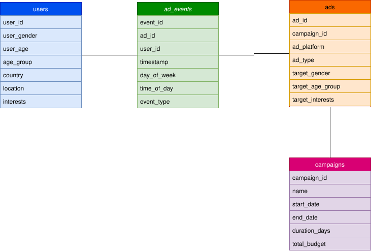
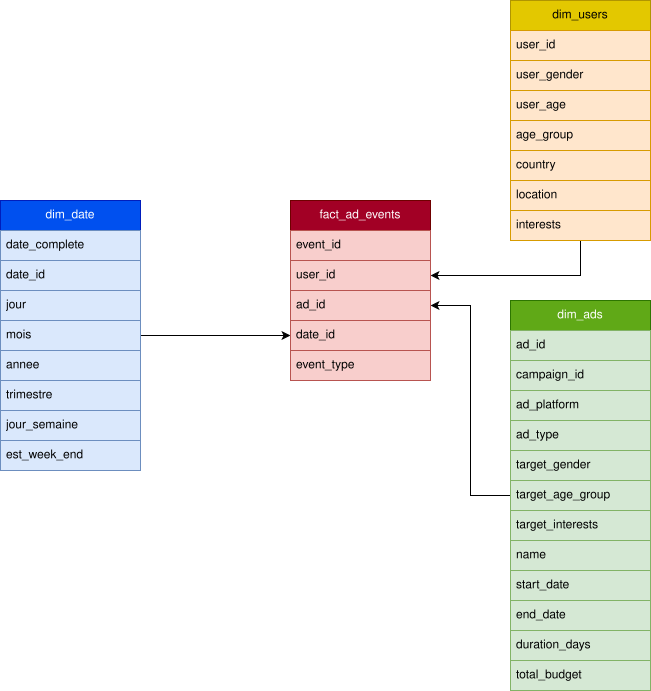

Here is the detailed description in English, in Markdown format:

# Project Documentation: Advertising Data Warehouse

## 1. Description of the domain and the process

### Domain: Digital Advertising Performance Analysis

The domain of this project is **Digital Marketing Analytics**. In today's digital economy, companies deploy advertising content on multiple platforms (such as Facebook and Instagram) to reach specific demographic segments. Managing these campaigns generates vast amounts of fragmented data that must be synthesized to understand the effectiveness of marketing.

### Processes covered

The Data Warehouse (DW) covers the complete lifecycle of digital advertisements:

1. **Campaign Planning**: Definition of budgets, durations, and seasonal themes (e.g., "Summer Launch" vs "Winter Promotion").
2. **Ad Placement**: Distribution of specific creative content (Videos, Stories, Carousels) targeted towards precise audience segments (by age, gender, and interests).
3. **User Engagement**: Tracking real-time user interactions, ranging from passive viewing (**Impressions**) to active engagement (**Clicks**, **Likes**, **Shares**) and final conversions (**Purchases**).
4. **Audience Demographics**: Correlation of these interactions with user profiles (country, age group, specific interests) to identify who actually responds to advertisements.

### Motivation for creating the Data Warehouse (DW)

* **ROI Analysis**: Calculate **Return on Advertising Spend (ROAS)** by comparing campaign budgets with the resulting purchase events.
* **Audience Optimization**: Identify "high-value" demographic segments to refine future targeting and reduce unnecessary advertising spend.
* **Temporal Trends**: Analyze how advertising performance fluctuates by time of day or day of the week to optimize planning (e.g., "Do users click more on Friday evenings?").

---

## 2. Description of technologies used

To build this solution on a **Linux environment**, a robust and open-source technology stack was selected:

### Database and Storage

* **SQLite**: Chosen as the relational database management system (RDBMS). It is native to Linux, requires no server configuration (serverless), and stores the entire database in a single portable file. It is perfect for a lightweight yet powerful Data Warehouse.
* **SQL (Structured Query Language)**: Used to create the schema, perform data transformations (DML), and extract analytics.

### Business Intelligence (BI) and Visualization

* **Apache Superset**: A high-performance visualization engine frequently used in Linux environments for more complex data exploration and large-scale dashboards.

### Data Processing (ETL)

* **Python**: Use of libraries such as `pandas` or `sqlite3` on Linux to automate the cleaning, joining, and loading of CSV files into the SQLite star model.

## 3. Description of the dataset

## 4. Description of the DW star schema model

## 5. Description of the ETL process

## 6. 3 reports built in selected BI tool
